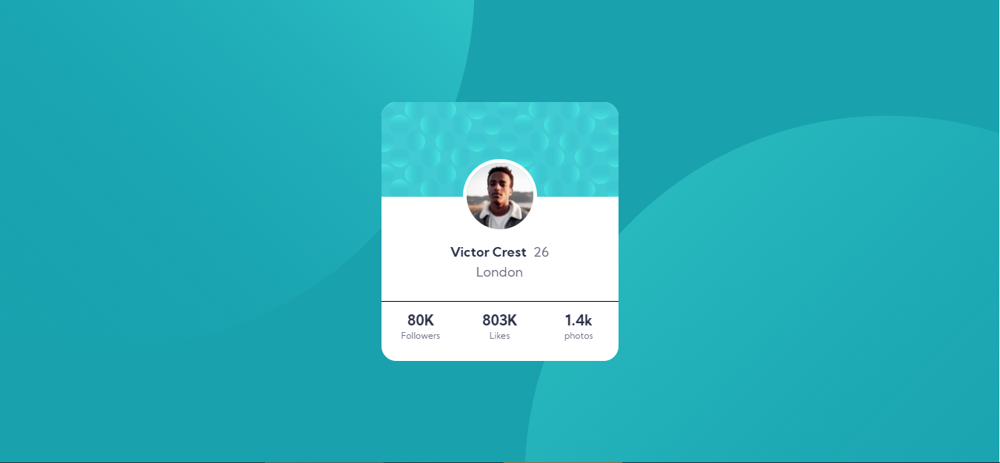
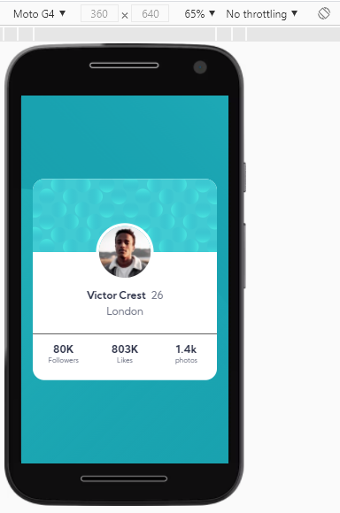

## Front-End Mentors Profile Card Component Challenge

This is a complete responsive design of profile card component.

This is a challenge from fronendmentors.io and I completed it successfully.

The tools used here are:

- HTML
- CSS
- CSS Grid
- CSS Flexbox
- Google Fonts
